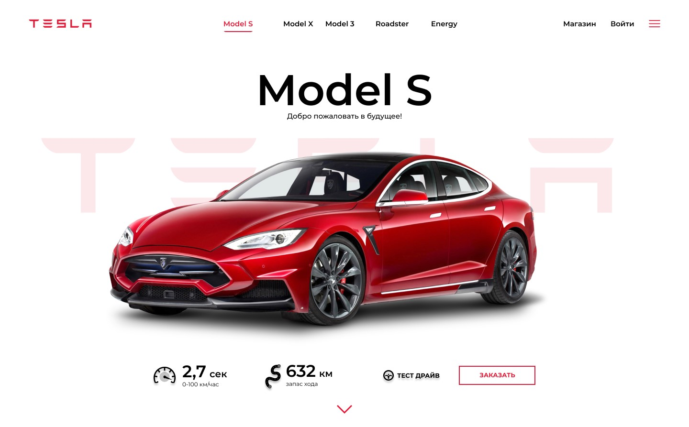

# Tesla website. Практика HTML/CSS.

## Макет сайта
https://www.figma.com/design/P94fDBysm0m4pVRuDrZ3Sxgu/Tesla?node-id=1-2&node-type=frame&t=cxVsjGsrtanhKjxR-0

### Целью верстки данного сайта было закрепление следующих заний:
- Структура HTML документа
- Основные теги и их атрибуты
- Виды ссылок
- Виды селекторов
- Единицы измерения
- Работа с макетоми
- Свойство display, строчные и блочные элементы
- Основы Flexbox и Grid layout
- Свойства position
- Основы создания адаптивного сайта
- Медиазапросы
- Препроцессор SASS
- БЭМ методология

Код валидный, типографирован. Все непонятные моменты макета решались по усмотрению разработчика. 